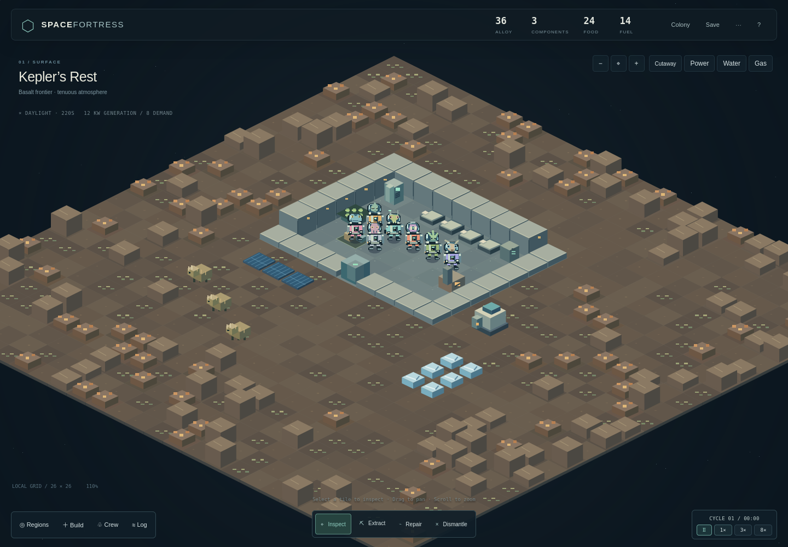

# SPACEFORTRESS

An early playable space colony simulator inspired by Dwarf Fortress. Keep seven alien founders alive, build a planetary colony, and send supplied expeditions into orbit to recover material for its next expansion.



**The game is still in development.** The current build has one colony floor and fixed orbital destinations. Staffed outposts, connected vertical decks, a generated universe/history and much of the wider simulation remain unfinished. The [implementation status](docs/implementation-status.md) separates working systems from plans.

## Play locally

You need **Python 3** and a recent desktop browser with JavaScript and Canvas support. **Node.js 20 or newer** is needed only to run the tests. Linux development currently uses Python 3.12 and Node 20, with Firefox browser checks; wider platform/browser coverage is limited.

Clone the public GitHub repository with:

```sh
git clone https://github.com/Jaredcastorena/spacefortress.git
cd spacefortress
```

You can also download and extract the source archive from the repository page. In the project directory, run:

```sh
python3 tools/serve.py
```

On Windows, use `py -3 tools/serve.py` if Python is installed through that launcher. Open **[http://127.0.0.1:8420/](http://127.0.0.1:8420/)**. Keep the terminal open while playing; **Ctrl+C** stops the server. Use the server rather than opening `index.html` directly, because the game loads JavaScript modules.

If port 8420 is already in use:

```sh
python3 tools/serve.py --port 8421
```

Then open `http://127.0.0.1:8421/`. A different port has separate browser save storage; export your colony before moving between addresses.

There is **no build step or package installation**. Python serves the files on your own computer; the simulation runs in the browser. All game code and graphics are local. The game makes no external runtime network calls and needs no account, cloud service, asset download or model download. Once you have the source and tools, it runs offline through the local server.

## First session

1. Pause with **Space** and inspect the starting colony. **Colony**, **Crew** and **Log** open details; **Esc** closes menus.
2. Use **Build** to select a structure, then click a valid tile. Crew reserve real supplies, collect them and work at the site. Inspect blocked work for its reason.
3. Use **Extract** on deposits. Keep routes clear, supplies accessible, and life support powered and stocked. Pressure doors, leaks and cold rooms affect the crew.
4. Open **Regions → Relay K-07**, choose two ready crew and prepare an expedition. Workers must load its supplies before the selected pair walks to the shuttle. At the wreck, extract satellite material, let crew carry it to the dock, then recall them.
5. Use returned parts for an advanced solar array or a paid shuttle fitting. See the [colony-to-orbit walkthrough](docs/orbital-colony-loop.md) for the complete loop and its limits.

### Controls

| Input | Action |
| --- | --- |
| Click a tile | Inspect it, or designate the selected work |
| Drag the map / arrow keys | Pan |
| Mouse wheel / − and + | Zoom |
| Home / center button | Center the view |
| Space / time buttons | Pause or select 1×, 3× or 8× speed |
| 1 / 2 / 3 / 4 | Inspect / Extract / Repair / Dismantle |
| Esc | Return to inspection and close drawers |
| Build / Regions / Crew / Colony / Log | Open the corresponding menu |
| Cutaway / Power / Water / Gas | Toggle map views |
| ? | Open the in-game guide |

Keyboard shortcuts are inactive while editing a form or using a dialog. If a button has focus, use the time controls or focus the map before pressing Space.

## What is playable

- **Colony work:** physical material reservations, mining, hauling, construction, staffed production, finite depots, food preservation, farming and recycling.
- **Crew lives:** work duties and skills, hunger, rest, social needs, housing, injuries, medical treatment, carrying patients and bedside care.
- **Environmental systems:** compartment gases, pressure doors, finite gas networks and retained exhaust, room heat, water plumbing and spills, fire/smoke, wired power, batteries, reactors and wet-fault breakers.
- **Orbital expeditions:** explicit two-person crews, physical loading/boarding, limited cargo, satellite salvage, comet resources, solar collection, return trips and supplied fittings.
- **Original setting:** alien crew, bristleback livestock, biomass-eating tibbles and small fictional anomalies, shown on an isometric map with details in drawers.
- **Local simulation interface:** shared player/agent actions, stable entity IDs, structured observations and optional bounded recordings. No model or training service is included.

These are game-scale models with documented gaps, not full Dwarf Fortress parity or realistic engineering simulations. The [conversion inventory](docs/conversion-inventory.md) tracks the broader work. The [staffed outpost design](docs/staffed-orbital-outpost-design.md) is a proposal, not a playable feature.

## Saves and recordings

**Save** writes the colony into this browser's local storage under `spacefortress-save-v1`. The game also autosaves every 30 simulation ticks and when the page is hidden or closed. Saves are tied to the browser profile and page origin, including the port; clearing browser data can remove them. Nothing is uploaded to a server or written into the source tree.

Use **⋯ → Export save** for a portable JSON backup, and **⋯ → Import save** to restore one. Import replaces the current colony after validation; export first if you want to keep both. **New colony** also replaces the current colony and asks for confirmation. If an existing save cannot be read, the game protects it from automatic replacement and offers its original contents for export. When browser storage is unavailable, use export to keep your progress.

Optional **Start recording / Export recording** controls export local NDJSON observations and actions. Recordings are bounded, are separate from save files, and do not change simulation results. See the [simulation interface](docs/simulation-interface.md).

## Elements lab

Open **[http://127.0.0.1:8420/elements.html](http://127.0.0.1:8420/elements.html)** for the separate air/water/fire/vacuum/electricity sandbox. It starts paused; choose a scenario or brush, then **Step** or **Run**. The reactor scenario includes finite fuel, waste heat, radiators and overheat recovery.

The lab has its own state and does not change the colony save. Its cell simulation is separate from the colony's room simulation. [Lab rules and controls](docs/elements-lab.md) explain the differences.

## Development and tests

From the project directory:

```sh
node --test tests
```

The suite uses Node's built-in test runner. No `npm install` is required. If npm is already available, `npm start` and `npm test` provide project aliases; use the explicit Python launcher above on Windows. Windows/macOS instructions are source-derived, not claims of completed platform test runs.

The local server has a separate standard-library regression suite:

```sh
python3 -m unittest discover -s tests -p 'test_*.py'
```

On Windows, replace `python3` in that command with `py -3`.

Simulation modules live in `src/`; the interface and Canvas renderer are separate from simulation state. Tests and save fixtures are in `tests/`. Keep the compressed save fixtures when copying the project.

The [verification record](docs/verification-status.md) describes historical checks and their limits. [Release readiness](docs/release-readiness.md) tracks the current publication checks; a passing test suite does not establish that the whole game is finished or every browser is supported.

## Documentation

| Topic | Start here |
| --- | --- |
| Current scope and roadmap | [Implementation status](docs/implementation-status.md), [conversion inventory](docs/conversion-inventory.md) |
| Supplies and construction | [Construction logistics](docs/construction-logistics.md), [production](docs/production-and-logistics.md), [storage](docs/depot-storage.md) |
| Crew and care | [Crew life](docs/crew-life.md), [medicine](docs/medicine.md), [rescue and nursing](docs/rescue-and-nursing.md) |
| Environment and utilities | [Atmosphere](docs/atmosphere.md), [gas networks](docs/gas-networks.md), [plumbing](docs/plumbing.md), [power](docs/power-networks.md), [fire](docs/fire-and-smoke.md) |
| Travel | [Departure preparation](docs/departure-preparation.md), [expedition logistics](docs/expedition-logistics.md), [orbital loop](docs/orbital-colony-loop.md) |
| Developer interface | [Simulation actions and recording](docs/simulation-interface.md), [elements lab](docs/elements-lab.md) |

## Contributing and license

See [CONTRIBUTING.md](CONTRIBUTING.md) for development conventions and pull requests, the [Code of Conduct](CODE_OF_CONDUCT.md) for community expectations, and [SECURITY.md](SECURITY.md) for vulnerability reporting.

SPACEFORTRESS is licensed under the [MIT License](LICENSE), copyright 2026 Jared Castorena. Code, code-native artwork and project data are covered by that license. No third-party game assets are bundled.
